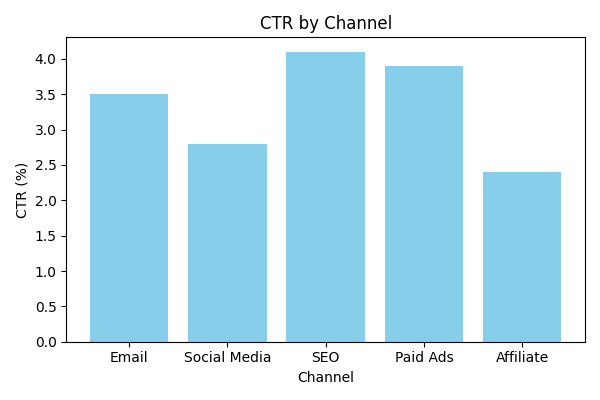
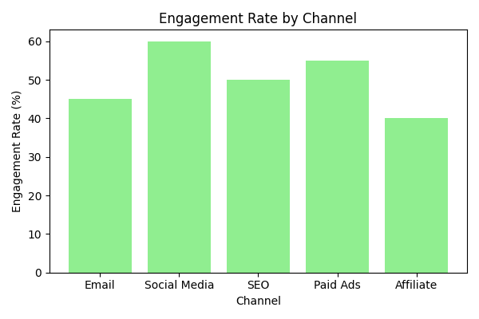

# Multi-Channel Campaign Performance Dashboard

This project demonstrates tracking and visualizing digital marketing campaign performance across multiple channels. The dashboard helps analyze CTR (Click-Through Rate) and Engagement metrics for better insights and decision-making.

## Tools & Tech Stack
- Python 3
- Jupyter Notebook
- Pandas
- Matplotlib

## How to Run
1. Clone the repository
2. Open `notebooks/dashboard_analysis.ipynb` in Jupyter Notebook
3. Run all cells to generate charts and reports
4. Check the `reports/` folder for generated images and Excel reports

## Key Insights
- Visualized CTR and Engagement across multiple channels
- Charts saved as PNG in `reports/` folder
- Sample dataset used for demonstration

## Screenshots
### CTR by Channel

### Engagement by Channel

